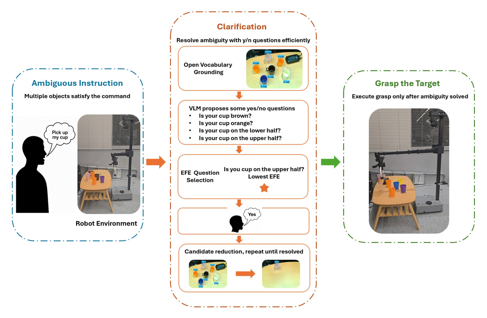

# ActivAsk



ActivAsk is a zero-shot framework for resolving referential ambiguity before robotic grasping. It constructs open-vocabulary candidates from RGB-D input, asks candidate-grounded yes/no questions when needed, updates the candidate state from the user's answer, and grasps after target resolution.

This repository contains the public evaluation data, system prompt materials, calibration sweep, scene images, instruction pools, analysis scripts, and minimal demos associated with ActivAsk:

> **ActivAsk: Free-Energy-Guided Clarification for Robotic Grasping under Ambiguous Instructions**  
> Haoandong Yang, Gabriel W. Haddon-Hill, Teresa Zielinska, and Shingo Murata  

ActivAsk selects among VLM-proposed candidate partitions using an expected-free-energy criterion motivated by active inference. With neutral response preferences, the deployed score reduces to information gain over candidate partitions.

## How to Run

The analysis tables can be generated from the released CSV files without robot hardware or model weights.

```bash
python -m venv .venv
source .venv/bin/activate
pip install -r requirements.txt
python analysis/run_tables.py
```

Optional checks:

```bash
python analysis/plot_threshold_sweep.py
python examples/efe_selection_demo.py
python examples/offline_trial_demo.py
python examples/online_trial_demo.py
```

## Repository Structure

- `data/offline_trials.csv`: per-trial target-resolution data for 1,512 offline trials.
- `data/online_trials.csv`: per-trial robot-execution data for 228 online trials.
- `data/scenes/`: released scene observation images.
- `data/instruction_pools/`: per-scene instruction pools grouped by instruction type.
- `data/calibration/`: detector threshold sweep data and selected detector thresholds.
- `prompts/`: VLM system prompt, policy-specific role instructions, direct-decision prompt, and JSON output schema.
- `analysis/`: scripts for generating analysis tables from the public CSV files.
- `activask/`: minimal policy implementation for instruction term tokenization, candidate-state updates, question selection, baselines, and the online execution gate.
- `examples/`: minimal offline/online examples, the EFE-style question-selection example, and a model setup template.
- `videos/`: supplementary real-robot videos grouped by object category and outcome.

## Installation

Python 3.12.3 is recommended.

```bash
python -m venv .venv
source .venv/bin/activate
pip install -r requirements.txt
```

## Supplementary Videos

Videos follow the object categories used in the study and are organized as:

```text
videos/
  Bottle/{Success,Failed}/
  Cup/{Success,Failed}/
  Utensil/{Success,Failed}/
```

Each clip is a representative real-robot execution trial for the corresponding category and outcome.

## Hardware Scope

The statistics, calibration, scene-image inspection, instruction-pool sampling, and EFE demo run without robot hardware.

The online experiments used:

- Robot: Hello Robot Stretch SE3 / Stretch 3-class mobile manipulator.
- Camera: head-mounted Intel RealSense D435i RGB-D camera.
- Compute: an NVIDIA RTX 6000 Ada Generation GPU workstation.
- Runtime split: the GPU workstation ran the web service, GroundingDINO, SAM, and MiMo-VL; the robot-side service executed waypoint trajectories over ZeroMQ.

Model weights are not included in this repository.

Open-source external components used:

- GroundingDINO: <https://github.com/IDEA-Research/GroundingDINO>
- Segment Anything: <https://github.com/facebookresearch/segment-anything>
- MiMo-VL-7B-RL-2508: <https://huggingface.co/XiaomiMiMo/MiMo-VL-7B-RL-2508>

Download the model weights from the upstream projects and connect them through local paths or a local VLM endpoint. A minimal interface template is provided at `examples/model_setup.example.env`. The public CSV analysis and minimal examples do not require these model weights.

## Licenses

Code is released under the MIT License. Data, scene images, calibration tables, and videos are released under CC BY 4.0; see `DATA_LICENSE`.
